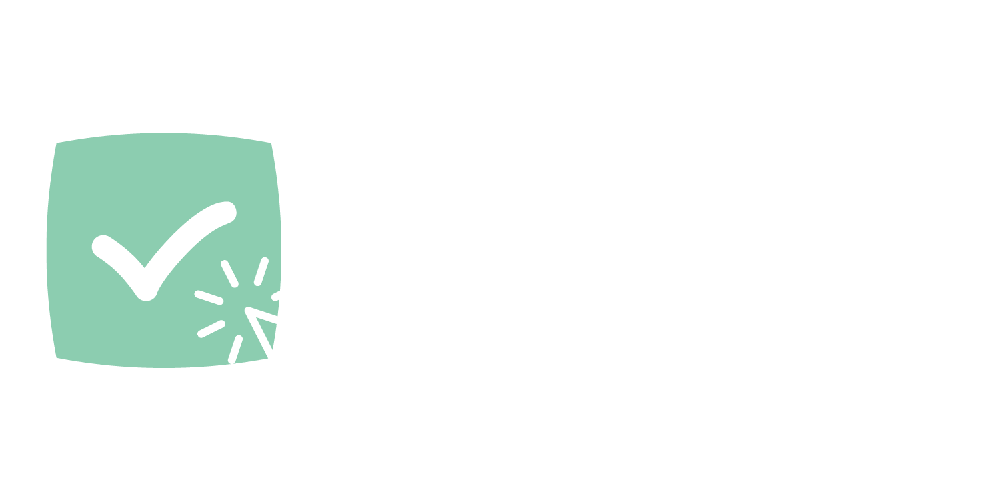

<!-- One -->
<section id="one">
	

    
		<header class="major">
			<!--<h1>Swedish</h1>-->
		</header>

<!-- Content -->
<h2 id="content">🇸🇪 Certifiering?</h2>

<b>FGHTech AB</b> erbjuder certifikation av webbutiker mot ansökan. Vi jobbar helt ideélt och tar inte emot någon som helst betalning. Vi certifierar därför endast webshoppar som uppfyller våra standarder, se nedan:  

<b>Företaget</b> 
- Svenskt företag 
- Svenskt lager 
- Hjälpsam Svensk support utan strul och snabb svarstid 
 <b>Hemsidan</b> 
- Leveranstid och leveransinfo överensstämmer 
- Säker e-handelsplattform 
- Säkra betalmetoder 
- Inget strul om produkten går sönder 

 <b>Hur vet jag säkert?</b> 

För att en butik skall vara certifierad så skall den ha ikonen "FGHTech Certified webshop" och finnas med i listan i botten av denna sida. Dessutom skall ikonen gå att klicka på och ta dig till denna sida. <a href="#certifiedshops">Klicka här eller scrolla ner för att se de certifierade butikerna.</a>

  

<h2 id="content">🇬🇧 Certification? What?</h2>

<b>FGHTech AB</b> offers certification of webshops by application. This part of FGHTech is entirely volontarily and we don't charge a dime. We only certiy webshops that meet our standars, as our reputation is on the line:  

<b>The company</b> 
- Swedish company 
- Swedish warehouse & fulfillment 
- Helpful Swedish and or "Swedish + English" support without a hassle 
 <b>The website</b> 
- Deliverytime och deliveryinfo is correct 
- Safe e-commerce platform 
- Safe payments 
- No Fuzz if the product breaks 

 <b>How do i know for sure?</b> 
For a shop to be certified, it needs the icon "FGHTech Certified webshop" and it needs to be listed in the list at the bottom of the page. The icon must link to this page you are on currently visiting. <a href="#certifiedshops">Click here or scroll down to see the certified shops!</a>

  
  

<h2>🇸🇪  Varför?</h2>

Vi på FGHTech AB äger själva ett nätverk av webshoppar och har genom åren blivit kontaktade av företag som "certifierar webshoppar". Många av dessa tjänster är både bluffar och försöker sälja sin tjänst till dyra pengar. 
Vi certifierar därför andras webshoppar helt ideélt, men endast webshoppar vi verkligen tror på.

  

<h2>🇬🇧 Why?</h2>

FGHTech AB owns a network of webshops and has been contacted many times through the years by companies who "certify" weshops despite not running one themselves. Therefore we decided to certify shops based on a non bullshit principle and doing it without charging a dime. Therefore, we only certify webshops we really believe in. 
Vi certifierar därför andras webshoppar helt ideélt

  
  

<h2 id="">🇸🇪/🇬🇧 Current certified stores:</h2>

<u>This is the current and full list of FGHTech Certified stores:</u> 
- kabeltugg.se 
- norie.se 
- fidgetflip.se 
- veriott.com 
 
If you have found a store not on this list with our badge, STAY AWAY! And report it to us through the form below. Also, if you have any complaints send us a message and we'll look over the webshop ⬇

  
  
  
<!-- Three -->
<section id="three">
	

		<header class="major">
		</header>
		<ul class="actions">
			<li><a href="/services" class="button next">Learn more about FGHTech!</a></li>
		</ul>
	

</section>
  

