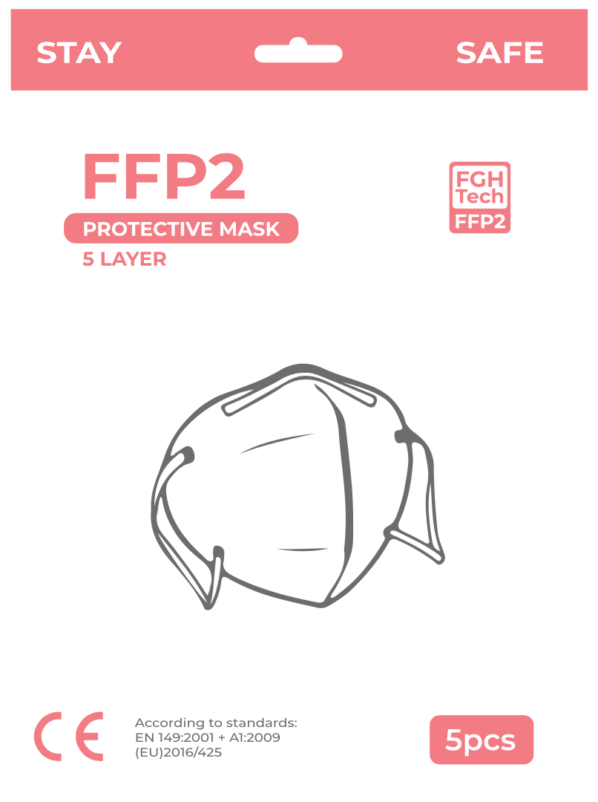
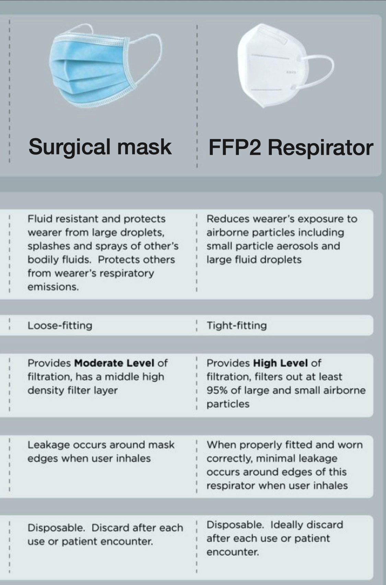
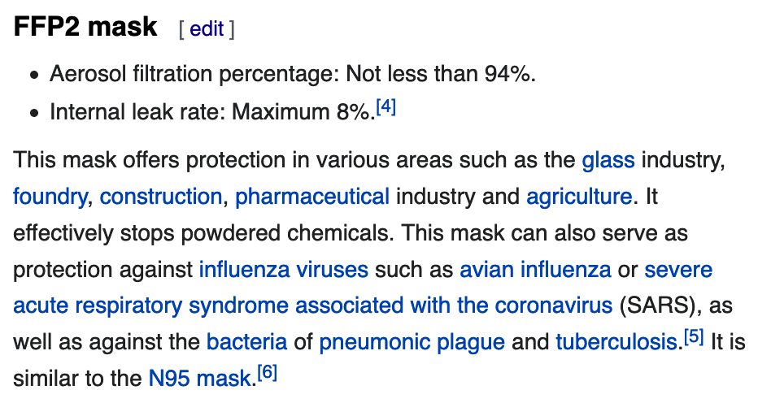

<!-- One -->
<section id="one">
	

    <!---->
		<header class="major">
			<h1>Facemasks and certificates</h1>
		</header>

<!-- Content -->
<!-- <h2 id="content">Sample Content</h2> -->

FGHTech decided to import facemasks after seeing the Swedish marked being flooded with expensive, and non-genuine facemasks. With our many years of experience in over-seas trade, we have reliable and reputable contacts around the world. Thus we are able to source masks of good quyality and sell them to you for a good price.

<h3>Why? [We sell these masks at a resonable price <u>today</u>, so that we can <u>look back</u> at the pandemic and be <u>proud of helping</u>.]</h3>

<section id="two" class="spotlights">
	<section>
		
		

			

				<header class="major">
					<h3>The FFP2 Mask</h3>
				</header>
				
This facemask protects yourself when social distancing is not an option.

				
Example of when to use: 
				- Grocery shopping 
				- Traveling 
				- Public areas 
				<u>Stay safe with an FFP2 mask.</u>
				

				

				<u>Classification:</u>
				<b> FFP2</b> NR 
				Model Number: BP001KN-95 
				<u>CE certificate issued:</u> 
				25/06/2020 by Universal Certification in Europe 
				

				
[Note] <i>Normal surgical masks only help decrease spread if the wearer is infected, but is not certified to protect oneself. Therefore FFP2 is a good option when around people not wearing mask.</i>

				<ul class="actions">
					<li><a href="generic.html" class="button">BUY NOW!</a></li>
					<li><a href="assets/pdfs/SurgicalCert.pdf" class="button">See certificates here.</a></li>
				</ul>
			

		

	</section>
	<section>
		
		

			

				<header class="major">
					<h3>FFP2 vs IIR Surgical mask</h3>
				</header>
				
Educate yourself on your purchase. FFP2 provides a high level of filtration, while IIR Surgical masks provide moderate levels of filtration. IIR masks are single use disposable masks, compared to FFP2 masks which are reusable within their 4h service life (on your own risk). If the FFP2 mask is left for 2 weeks, it is normally safe to reuse see more <a href="https://www.ncbi.nlm.nih.gov/pmc/articles/PMC7153525/">here</a>

				<ul class="actions">
					<li><a href="https://www.ncbi.nlm.nih.gov/pmc/articles/PMC7153525/" class="button">Reuse FFP2</a></li>
				</ul>
			

		

	</section>
		<!--<section>
		
		

			

				<header class="major">
					<h3>FFP2 info from Wikipedia</h3>
				</header>
				
Educate yourself on your purchase. Here is a screenshot from Wikipedia (25 July, 2020).

				<ul class="actions">
					<li><a href="https://en.wikipedia.org/wiki/FFP_mask" class="button">Go to Wikipedia</a></li>
				</ul>
			

		

	</section>-->
	<section>
		
		

			

				<header class="major">
					<h3>The IIR Surgical Mask</h3>
				</header>
				
When social distancing is not an option.

				
Example of when to use: 
				- Grocery shopping 
				- Traveling 
				- Public areas 
				<u>Help others by wearing a mask.</u>
				

				
[Note] <i>Normal surgical masks only help decrease spread if the wearer is infected, but is not certified to protect oneself. Therefore FFP2 is a good option when around people not wearing mask.</i>

				<ul class="actions">
					<li><a href="generic.html" class="button">BUY NOW!</a></li>
					<li><a href="assets/pdfs/SurgicalCert.pdf" class="button">See certificates here.</a></li>
				</ul>
			

		

	</section>
</section>

  
<!-- Three -->
<section id="three">
	

		<header class="major">
		</header>
		<ul class="actions">
			<li><a href="/services" class="button next">Learn more about FGHTech!</a></li>
		</ul>
	

</section>
  

