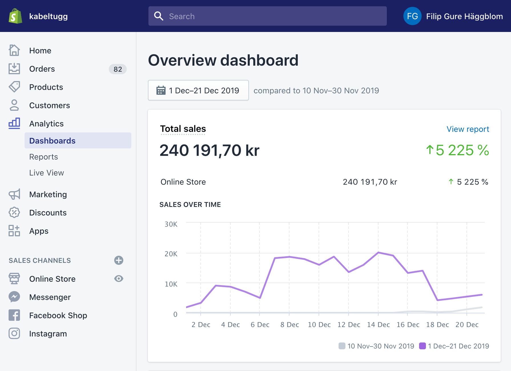
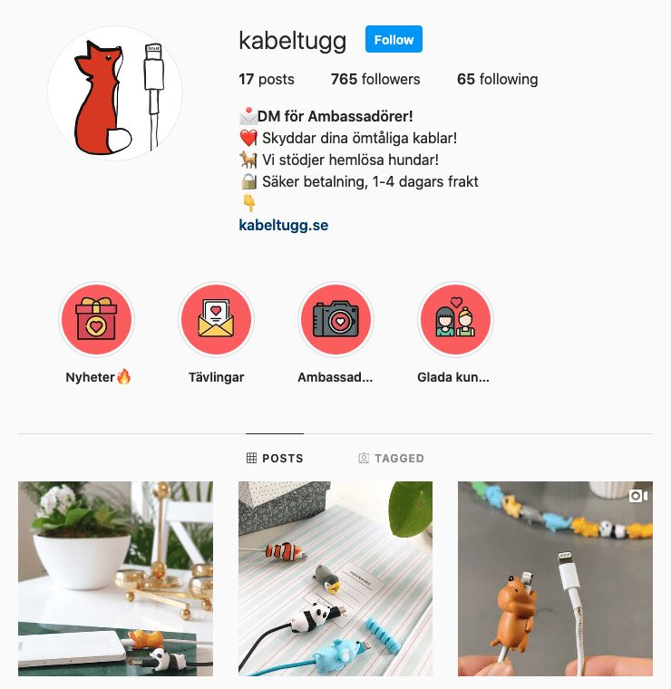
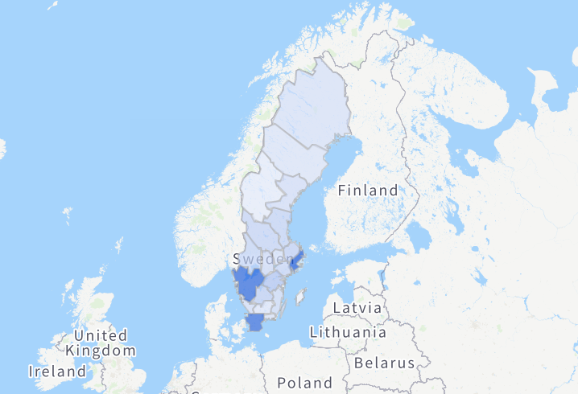

<!-- One -->
<section id="one">
	

    
		<header class="major">
			<h1>Proof of concept</h1>
		</header>

<!-- Content -->
<!-- <h2 id="content">Sample Content</h2> -->

Kabeltugg.se är en proof of concept webshop baserad på en ytterst annorlunda produkt. Genom att analysera och finna målgrupp användes riktad Facebook reklam och Instagram influensers för att uppnå en tillväxt från 0kr till +250k kr (1a December - 30e December)

<section id="two" class="spotlights">
	<section>
		
		

			

				<header class="major">
					<h3>Create a winning strategy</h3>
				</header>
				
Use up to date strategies in order to Capitalize on the market, and reap the benefits.

				<!-- <ul class="actions">
					<li><a href="generic.html" class="button">Learn more</a></li>
				</ul> -->
			

		

	</section>
	<section>
		
		

			

				<header class="major">
					<h3>Social media</h3>
				</header>
				
“The definition of insanity is doing the same thing over and over again, but expecting different results.” - Einstein  To be making the same mistake without iterating and staying ahead of the stream is important. Try, fail and try again with the new knowledge at hand.

				<!-- <ul class="actions">
					<li><a href="generic.html" class="button">Learn more</a></li>
				</ul> -->
			

		

	</section>
	<section>
		
		

			

				<header class="major">
					<h3>Make sure you are seen by the right people!</h3>
				</header>
				
A true seller can sell whatever to whomever, but it sure as hell pays off to find a good audience!

				<!-- <ul class="actions">
					<li><a href="generic.html" class="button">Learn more</a></li>
				</ul> -->
			

		

	</section>
</section>

  
<!-- Three -->
<section id="three">
	

		<header class="major">
		</header>
		<ul class="actions">
			<li><a href="/services" class="button next">What can we do?</a></li>
		</ul>
	

</section>
  

