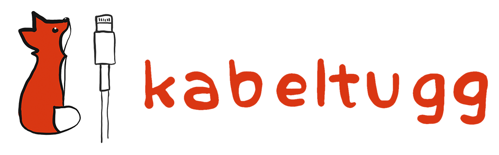
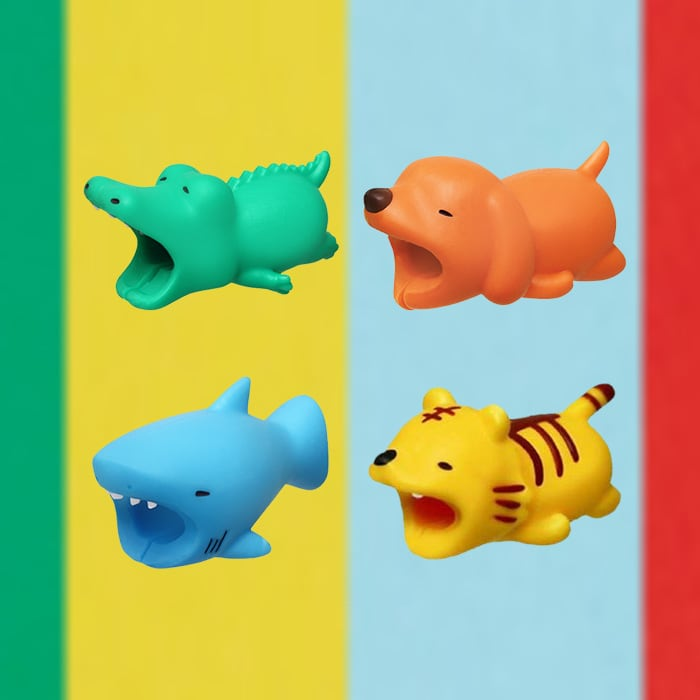

<!-- One -->
<section id="one">
	

    <!---->
		<header class="major">
			<h1>Webshops</h1>
		</header>

<!-- Content -->
<!-- <h2 id="content">Sample Content</h2> -->

Below you will find our network of webshops.

<section id="two" class="spotlights">
	<section>
		
		

			

				<header class="major">
					<h3>Kabeltugg.se</h3>
				</header>
				
Kabeltugg.se is a webshop based around the simple fact that charging cables break.

				<ul class="actions">
					<li><a href="/kabeltugg" class="button">Learn more</a></li>
				</ul>
			

		

	</section>
		<section>
		
		

			

				<header class="major">
					<h3>NORIE</h3>
				</header>
				
Norie Sells magnetic charging cables for all your portable devices.

				<ul class="actions">
					<li><a href="/norie" class="button">Learn more</a></li>
				</ul>
			

		

	</section>
</section>

  
<!-- Three -->
<section id="three">
	

		<header class="major">
		</header>
		<ul class="actions">
			<li><a href="/services" class="button next">Learn more about FGHTech!</a></li>
		</ul>
	

</section>
  

