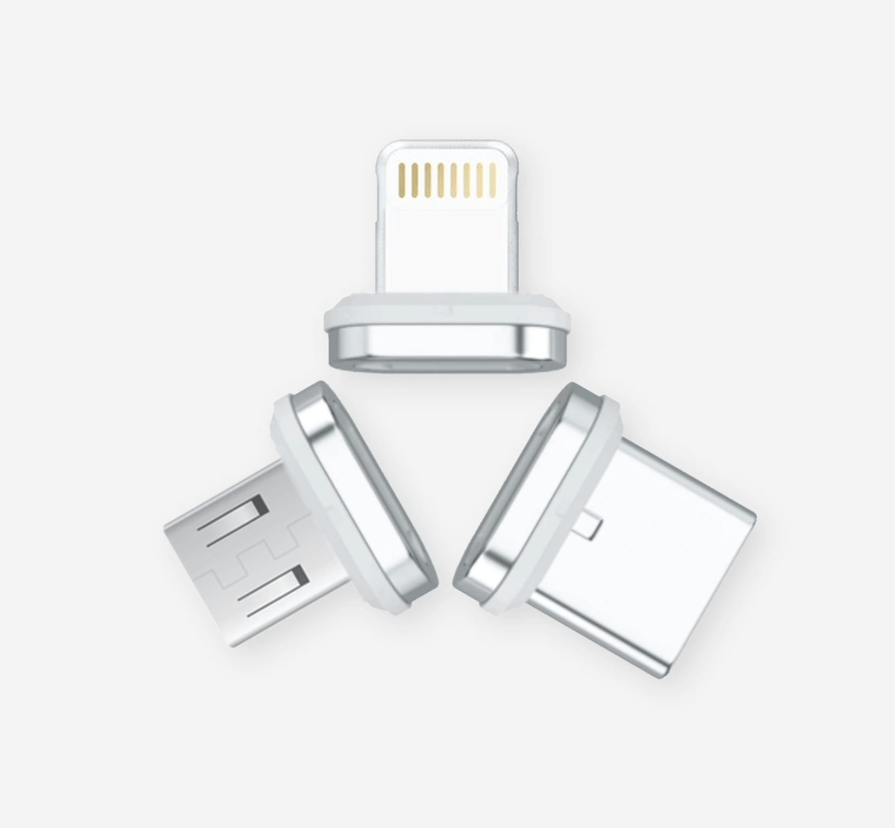
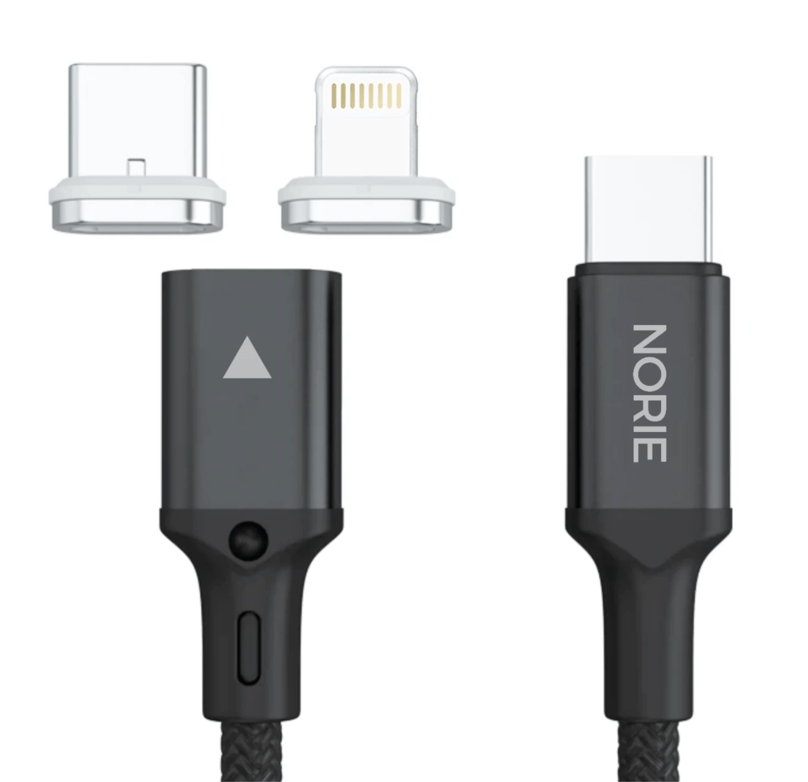

<!-- One -->
<section id="one">
	

    <!---->
		<header class="major">
			<h1>NORIE</h1>
		</header>

<!-- Content -->
<!-- <h2 id="content">Sample Content</h2> -->

NORIE is a webshop based around the simple fact that normal charging cables not only break, but that you need so many different ones!

<section id="two" class="spotlights">
	<section>
		
		

			

				<header class="major">
					<h3>The Product</h3>
				</header>
				
Small PVC cable protector that is made for the original Apple lightning connector.

				<!-- <ul class="actions">
					<li><a href="generic.html" class="button">Learn more</a></li>
				</ul> -->
			

		

	</section>
	<section>
		
		

			

				<header class="major">
					<h3>Social media</h3>
				</header>
				
“The definition of insanity is doing the same thing over and over again, but expecting different results.” - Einstein  To be making the same mistake without iterating and staying ahead of the stream is important. Try, fail and try again with the new knowledge at hand.

				<!-- <ul class="actions">
					<li><a href="generic.html" class="button">Learn more</a></li>
				</ul> -->
			

		

	</section>
	<!--<section>
		
		

			

				<header class="major">
					<h3>Soon expanding to the Nordic countries</h3>
				</header>
				
After infiltrating the Swedish market of cable protectors, Kabeltugg will move on to conquer all of the Norse countries.

			

		

	</section>-->
</section>

  
<!-- Three -->
<section id="three">
	

		<header class="major">
		</header>
		<ul class="actions">
			<li><a href="/services" class="button next">Learn more about FGHTech!</a></li>
		</ul>
	

</section>
  

