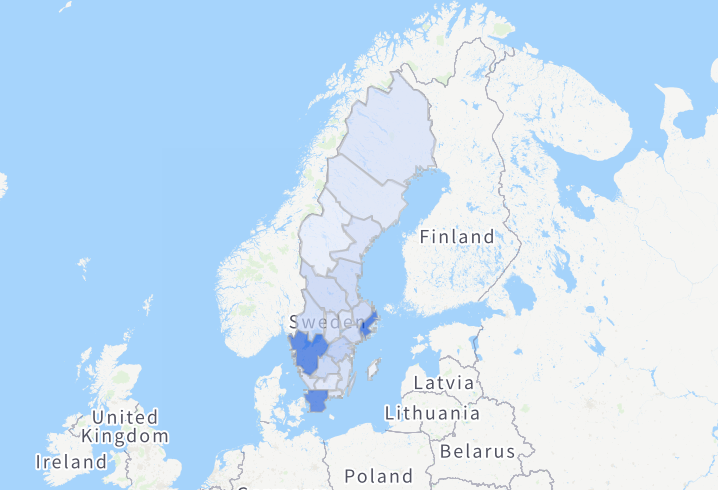

<!-- One -->
<section id="one">
	

    <!---->
		<header class="major">
			<h1>veriott.</h1>
		</header>

<!-- Content -->
<!-- <h2 id="content">Sample Content</h2> -->

NORIE is a webshop based around the simple fact that normal charging cables not only break, but that you need so many different ones!

<section id="two" class="spotlights">
	<section>
		
		

			

				<header class="major">
					<h3>The Product</h3>
				</header>
				
Small tin can filled with 10g of the best perfume.

				<ul class="actions">
						<li><a href="https://veriott.com/" class="button">Go to website</a></li>
				</ul>
			

		

	</section>
	<!--<section>
		
		

			

				<header class="major">
					<h3>Soon expanding to the Nordic countries</h3>
				</header>
				
After infiltrating the Swedish market of cable protectors, Kabeltugg will move on to conquer all of the Norse countries.

			

		

	</section>-->
</section>

  
<!-- Three -->
<section id="three">
	

		<header class="major">
		</header>
		<ul class="actions">
			<li><a href="/webshops" class="button next">Other webshops...</a></li>
		</ul>
	

</section>
  

